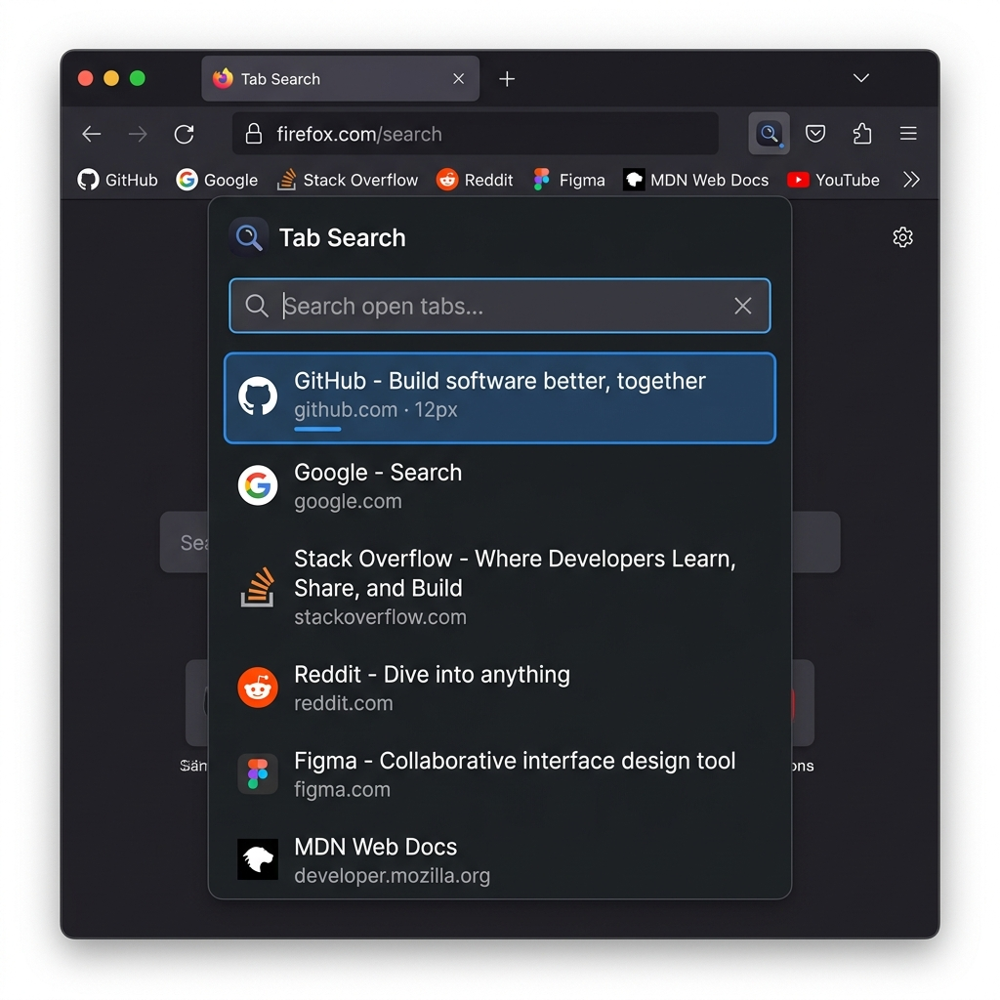

# Firefox Tab Search (DannyMode)



A blisteringly fast, hyper-optimized Tab Search extension for Firefox, engineered for power users. Built to achieve 100% feature-parity with Google Chrome's native Tab Search, and then pushing the boundaries even further.

## Why It's Awesome 🚀
Firefox natively lacks a rapid, keyboard-centric way to fuzzy-search open tabs and switch between them efficiently. 

This extension fixes that. It's built exactly how a Level 8 Mozilla Software Engineer would build it:
- **Zero Layout Thrashing:** Navigating the tab list uses DOM class toggling instead of full re-renders, giving you buttery smooth 60fps scrolling without any flickering.
- **Native OS Integration:** It correctly adapts to your system's Light/Dark mode natively via CSS media queries.
- **WAI-ARIA Compliant:** Fully accessible with screen readers.
- **Web-Ext Ready:** Includes standard Mozilla build tooling out of the box.

## Killer Features 🔥
- **Fuzzy Substring Highlighting:** Instantly highlights your exact search query in tab titles and URLs.
- **MRU Sorting (Most Recently Used):** Your tabs are logically ordered by when you last looked at them, not just left-to-right.
- **Container / Tab Group Support:** Displays native Firefox Container badges (Work, Personal, etc.) right next to the tab.
- **"Other Window" Badges:** Clearly labels tabs that are hiding in background windows.
- **Recently Closed Tabs:** Instantly restore accidentally closed tabs, complete with dynamic relative timestamps (e.g., `5m ago`).
- **Mute / Unmute (`Alt+M`):** Toggle audio on noisy background tabs without having to switch to them.
- **Pin / Unpin (`Alt+P`):** Instantly pin tabs directly from the search dropdown.
- **Pull to Current Window (`Shift+Enter`):** Rip a tab out of a background window and drop it directly into your current one.
- **Bookmarks Fallback:** If no open tabs match your search, it dynamically queries your Bookmarks!
- **Search Engine Fallback:** At the absolute bottom of the list, effortlessly press Enter to push your query to Google.

## Installation
1. Go to `about:debugging` in Firefox.
2. Click **This Firefox** -> **Load Temporary Add-on...**
3. Select `manifest.json`.
4. Press `Cmd+Shift+A` (or `Ctrl+Shift+A`) to open the search bar!

*(Note: If `Cmd+Shift+A` conflicts with Firefox's native Add-ons page, you can rebind it via `about:addons` > ⚙️ > Manage Extension Shortcuts).*

## Development
```bash
npm install
npm run lint
npm run build
```
